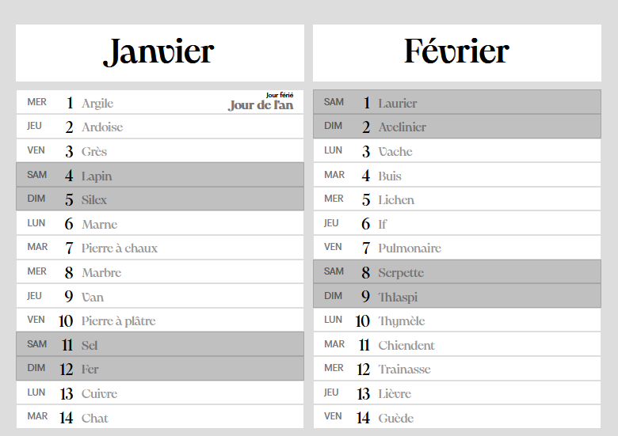
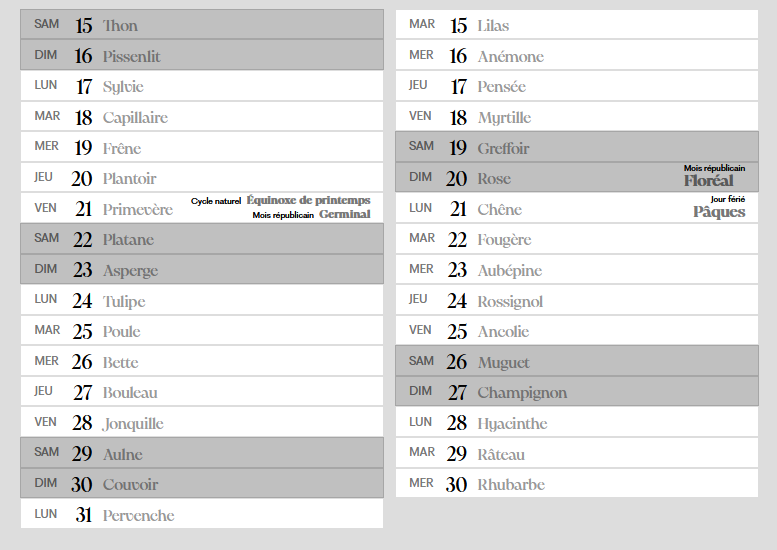

# Calendrier républicain

- [Download](#download)
- [Description](#description)
- [Develop locally](#develop-locally)

## Download

Ici > [Calendrier republicain 2025](./readme/calendrier-républicain-2025.pdf)

## Description




### FR - Une page HTML à imprimer

Une application statique en React qui génère 12 pages A4 que le navigateur peut imprimer.

Le calendrier **met en valeur les weekends** et permet d'**afficher des jours spéciaux**, comme les jours fériés, les solstices et équinoxes, ou les mois du [calendrier républicain](https://fr.wikipedia.org/wiki/Calendrier_r%C3%A9publicain).

Sont également mentionnés les noms de chaque jours du calendrier républicain.

### EN - An HTML page to print

A static React application that generates 12 A4 pages that the browser can print.

Calendar **highlights the weekends** and allows you to **display special days**, such as holidays, solstices and equinoxes, or [French Republican calendar](https://en.wikipedia.org/wiki/French_Republican_calendar) months.

Also mentioned the names of each day of the French Republican calendar.

## Develop locally

1. Install dependencies:

   ```bash
   npm i
   ```

2. Open `index.html` with Live Server in VS Code

   - Install Live Server extension if you haven't already
   - Right-click on `index.html` and select "Open with Live Server"

3. Print Setup
   - Press `Ctrl + P` in your browser
   - Select "Landscape" orientation for printing

### Configuration

To customize calendar's **special days**, edit `src/data/days.data.ts` which is sorted by month and day numbers.

You can externalize large amount of data, and also edit `Day.tsx`, as it is made to display data from `src/data/republican-days.data.ts`.
